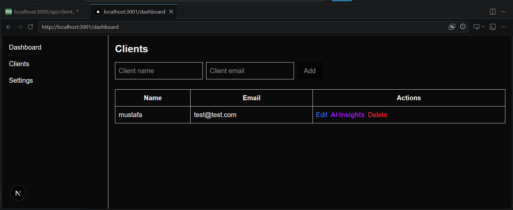

# AI SaaS Dashboard (Full-Stack CRM System)

A production-style Full-Stack SaaS CRM application built with modern web technologies, demonstrating real-world engineering practices including authentication, role-based access, CRUD operations, AI integration, and scalable architecture patterns.

### Key Highlights

 Secure JWT Authentication & Authorization
 Client Management System (CRUD Operations)
 Next.js + TypeScript Frontend
 Express.js REST API Backend
 PostgreSQL Database with Prisma ORM
 Protected Routes & Middleware Architecture
 Layered Architecture (Routes → Controllers → Services → Database)
 Production-Oriented Project Structure
 Frontend ↔ Backend API Integration
 Built to simulate a real SaaS startup application

### Project Purpose

This project simulates a real-world SaaS Customer Relationship Management (CRM) system designed for managing clients and enhancing decision-making using AI-powered insights.

The goal of this project is not only to demonstrate coding ability, but to reflect software engineering thinking, including:

 Scalable system design
 Clean architecture separation
 Backend service structure
 Secure authentication flows
 AI integration in real business workflows

## AI Feature (Key Highlight)

This project integrates AI to simulate real business intelligence inside a CRM system.

 AI Client Insights

Each client can be analyzed using AI to generate:

 Summary of client status
 Business opportunities (upsell / growth)
 Risks and potential issues
 Recommended next action

 ### AI Architecture

 Frontend sends client data to backend
 Backend processes request via service layer
 OpenAI API generates structured business insights
 Response is returned and displayed in dashboard UI

### Fallback System (Production Mindset)

In case AI service is unavailable (quota / errors), the system returns a fallback response to ensure:

 No UI failure
 Stable user experience
 Production-safe behavior

#  Tech Stack

### Frontend
 Next.js
 TypeScript
 Tailwind CSS
 Axios

### Backend
 Node.js
 Express.js
 JWT Authentication
 Prisma ORM
 PostgreSQL

### AI Integration
 OpenAI API
 Chat Completions API
 Fallback response system

## Authentication System

 JWT-based authentication
 Protected routes using middleware
 Token validation on each request
 Secure API access control

## Core Features

###  Client Management
 Create client
 Read clients list
 Update client data
 Delete client

###  Security Layer
 Auth middleware protection
 Token verification
 Protected API routes

###  AI-Powered CRM
 Generate client insights
 Analyze business opportunities
 Provide risk assessment
 Suggest next actions

 ##  Project Structure

backend/
├── controllers/
├── services/
├── routes/
├── middlewares/
├── ai/
└── app.js

frontend/
├── app/
├── components/
├── services/
├── types/
└── pages/

#  Installation & Setup

## 1. Clone the repository

``bash
git clone https://github.com/Codin-eng/AI-SaaS-Dashboard.git
cd AI-SaaS-Dashboard

## Connect

LinkedIn: https://www.linkedin.com/in/mustafa-719644412

###  Features

##  Clients Management (CRUD)
 Create client
 Get all clients (pagination ready)
 Update client
 Delete client

##  Screenshots

### Authentication
<table>
  <tr>
    <td></td>
  </tr>
</table>

### Dashboard
<table>
  <tr>
    <td></td>
    <td></td>
    <td></td>
  </tr>
</table>

### Clients
<table>
  <tr>
    <td></td>
    <td></td>
    <td></td>
  </tr>
</table>

#   Author

Built as a production-oriented full-stack SaaS project designed to demonstrate real-world software engineering practices including scalable architecture, authentication systems, and API design suitable for modern startup environments.