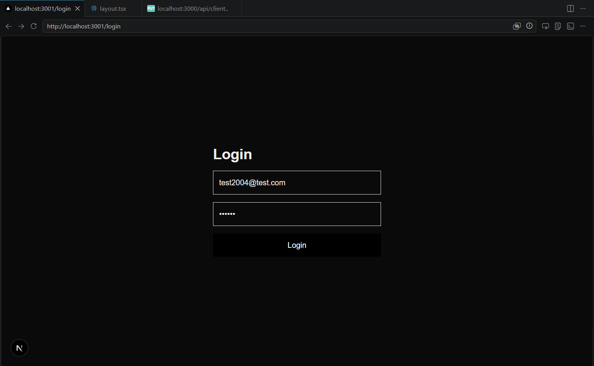
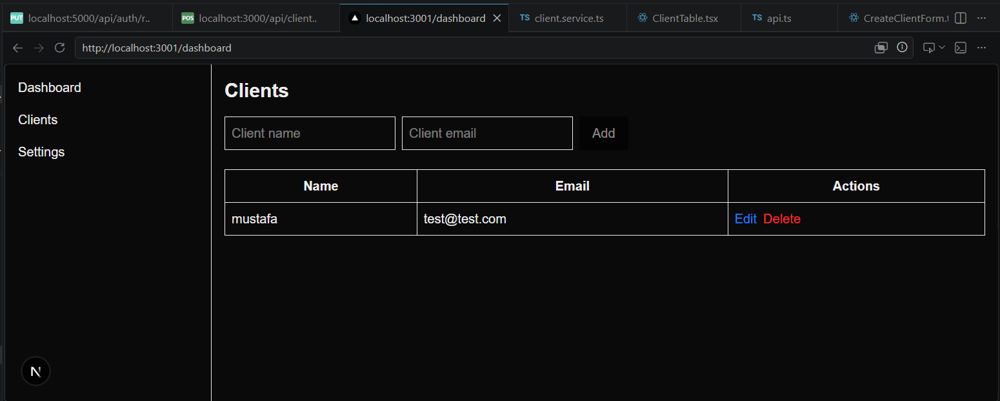
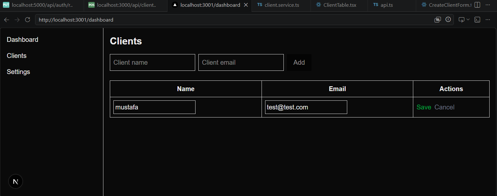
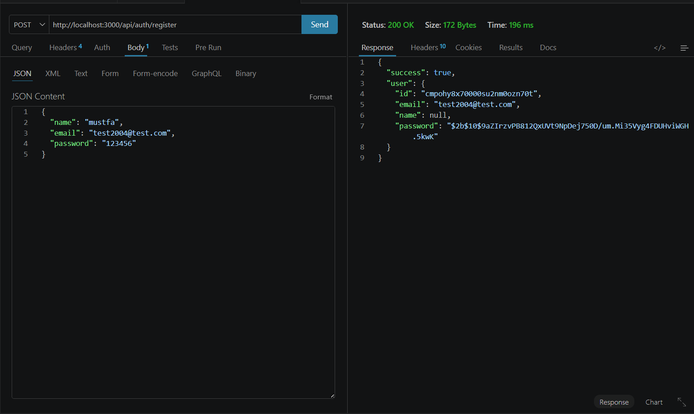
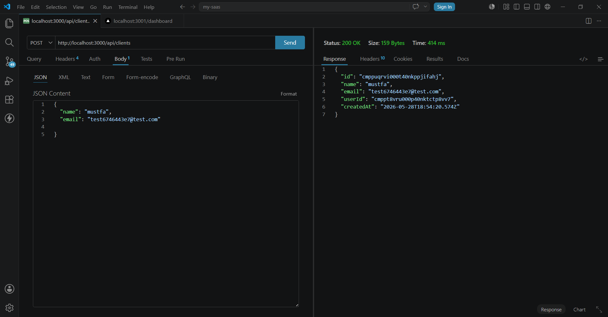
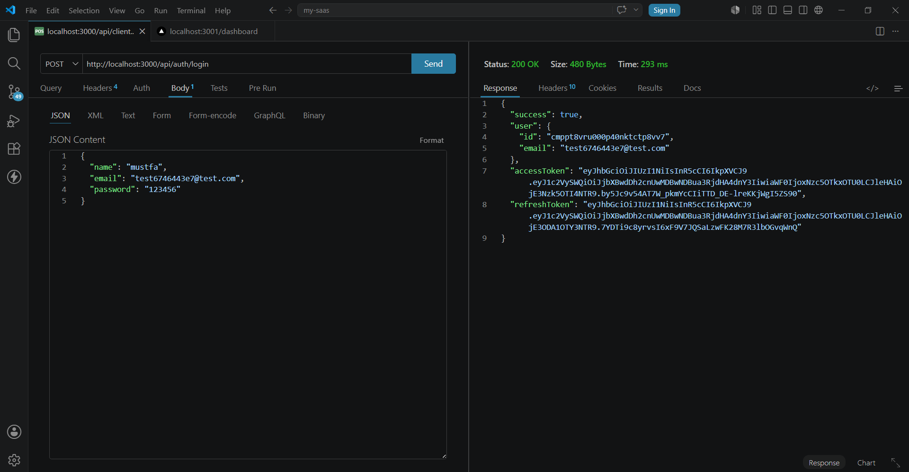

#  AI SaaS Dashboard

A full-stack SaaS application built with Next.js + Node.js + Prisma + PostgreSQL.  
The system provides authentication, client management, and a dashboard UI with a clean scalable architecture.

# Project Purpose

This project solves the problem of building a simple but scalable SaaS dashboard system that includes:

Secure user authentication (JWT)
Centralized client management system
REST API architecture
Clean separation of backend layers (Controller → Service → DB)
Production-ready frontend dashboard

=> The goal is to simulate a real SaaS product architecture used in startups.

#  Tech Stack

Frontend: Next.js (TypeScript)
Backend: Node.js + Express
Database: PostgreSQL + Prisma ORM
Authentication: JWT
Styling: Tailwind CSS

#  Installation & Setup

## 1. Clone the repository

``bash
git clone https://github.com/Codin-eng/AI-SaaS-Dashboard.git
cd AI-SaaS-Dashboard

###  Features

##  Authentication
 User register & login
 JWT authentication (access + refresh tokens)
 Protected routes (middleware)

##  Clients Management (CRUD)
 Create client
 Get all clients (pagination ready)
 Update client
 Delete client

##  Architecture
 Controller / Service / Route separation
 Middleware-based authentication
 Clean modular backend design

---

##  Screenshots

### Authentication
<table>
  <tr>
    <td></td>
  </tr>
</table>

### Dashboard
<table>
  <tr>
    <td></td>
    <td></td>
    
  </tr>
</table>

### Clients
<table>
  <tr>
    <td></td>
    <td></td>
    <td></td>
  </tr>
</table>

###  Tech Stack

### Frontend
 Next.js
 TypeScript
 Axios
 Tailwind CSS

### Backend
 Express.js
 Prisma ORM
 JWT
 bcrypt
 Zod validation

#   Author

Built as a production-oriented full-stack SaaS project designed to demonstrate real-world software engineering practices including scalable architecture, authentication systems, and API design suitable for modern startup environments.